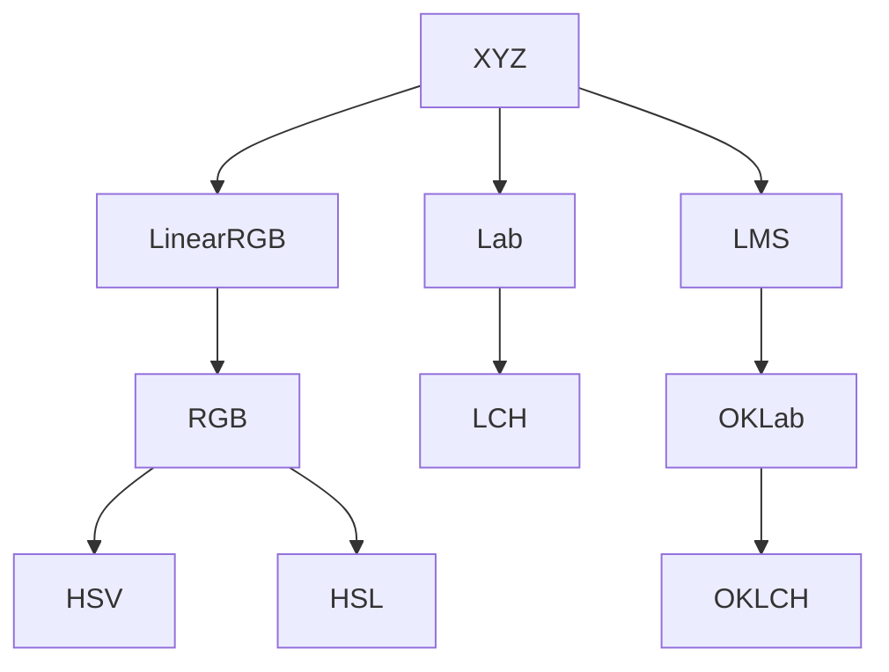

# OKColor.gml  

**OKColor** is a color management library for GameMaker written in pure GML that implements the new "industry standard" [OKLab](https://bottosson.github.io/posts/oklab/)/[OKLCH](https://evilmartians.com/chronicles/oklch-in-css-why-quit-rgb-hsl) models, among others.

It's simple to use with only one `OKColor` class and a bunch of methods providing [setting the color](), [models conversion](), [mixing]() and [getting the color for rendering]().

Navigate to [Installation]() and [How to use]().

## Why to use?

### Premise

The problem with the standard RGB and HSV models is that they're not taking into consideration the human perception of the color. That means that if you follow the same rules to set the color components, the resulting colors might not *look* like these rules were followed.

For example, if two colors only differ in `hue`, they won't be consistent for our eyes and seems like they also have different `saturation`/`value`, despite having the same ones in the code. The `hue` itself is not perfect either: it distributes colors unevenly, so adding the same amount of hue to different colors won't make them "move" the same distance in the color wheel. To overcome these issues, there have been attempts to create a perceptually correct color model with the most recent one being the "OK" family of color models.

OKLab is the starting point of it and is inspired by a perceptual model called CIELab, fixing some of its flaws. OKLCH is another member of the family and just a representation of OKLab in a "cylindrical" form, meaning it has the same relation to OKLab as HSV has to RGB. So OKLCH is a better alternative to HSV, where `L` represents `lightness` as the loose analogue of `value`, `C` is the `chroma` which is equal to `saturation` and `H` as in the `hue`.  

> [!NOTE]
> Provided examples may read incorrectly if you have a badly calibrated display and or non-trichromatic color vision.

Here is an example of a gradient generated with HSV model, all colors have the same `saturation` and `value` and showing all the possible `hue`:

And here is another one, generated with the *perceptually uniform* OKLCH model with the same `lightness` and `chroma` and different `hue` giving more consistent color, reflecting how human vision works:

Notice how there are differences in lightness for different hues in the top one and how the hue itself is distributed unevenly.

Converting both examples to perceptual grayscale shows the lightness flaws more obviously:

### Generating new colors

Usually, the choice of specific colors in the game is made manually by the game artists or art directors. However, there are some cases where colors need to be generated dynamically. This could be due to the specifics of a particular visual effect, a large number of assets requiring recolor or user-inputted customization. So, if you're generating color palettes for your game in-code and need consistent and predictable outcomes you should use this library with the perceptual color model.

#### Consistent matching colors

Let's say you want to recolor specific features of your character sprite in-game. One way is to generate a new palette using a basic `hue` shift in the HSV space. Another option is to use the OKLCH model and apply a `chroma` shift. This latter approach often provides more appealing results:

With OKLCH the lightness is consistent throughout all the hue changes, shadows and highlights remain intact, and the overall visual is enhanced. This extends to all other components: you can be sure that colors with the same `chroma` will have the same perceptual hue, unlike HSV which tends to shift hue when brightness is changed (for example making blue become [more purple]() when increasing `value`).

#### Predictable different colors

Otherwise, if instead you *need* the difference in color qualities such as for better accessibility, a perceptual color model is also beneficial.

For example, you want to color-code different collectables: blue one is standard, green is lighter and red is darker to make it easier for subconscious distinction and more accessible for color-blind people. You can generate the colors in HSV (note how the `value` drops by 10% for every next color to make it darker):

* Green: `hsv(120, 80%, 80%)`
* Blue: `hsv(180, 80%, 70%)`
* Red: `hsv(0, 80%, 60%)`

You can also generate three colors with OKLCH in a similar way (`lightness` is also decreased by 10% each time):

* Green: `oklch(75%, 0.18, 142)`
* Blue: `oklch(65%, 0.18, 202)`
* Red: `oklch(55%, 0.18, 27)`

And apply these colors to a collectable sprite:

&nbsp;

Testing would reveal that HSV results are not predictable: with the red appearing much darker than intended, and green and blue seemingly having similar brightness. OKLCH, on the other hand, provides more consistent and reasonable results, with each subsequent color being equally darker than the previous one, complementing the 10% change.

> [!IMPORTANT]
> Crucial information necessary for users to succeed.

> [!WARNING]
> Critical content demanding immediate user attention due to potential risks.

## TODO:
* ### ["Missing" color components](https://www.w3.org/TR/css-color-4/#missing)
  * Useful for proper [color mixing](https://www.w3.org/TR/css-color-4/#interpolation-missing).
  * Treat as 0 outside of mixing purposes.
  * Use [NaN (powerless)]() as a missing component?
* ### [“Powerless” color components](https://www.w3.org/TR/css-color-4/#powerless)
  * Basically the color components that are not contributing to the resulting rendered color, like `hue` in HSV, when the `saturation` is 0: no matter what hue angle is, the resulting color will be grey.
  * [Already implemented]() as NaN for `hue` in HSV/HSL implementations, should probably be extended to `lightness` cases and LCH models.
  * Combine with "missing" as the same thing?
* ### Alpha and premultiplied alpha
  * More sensible color mixing with [alpha interpolation](https://www.w3.org/TR/css-color-4/#interpolation-alpha).
* ### Linear RGB color mixing
* ### Hue/Chroma interpolation for color mixing?
  * Not sure if it is needed as Lab and OKLab models provide the subjectively best-looking mixing and LCH to my understanding should give the same results as Lab, but may be useful for someone.
* ### Wider color gamuts like P3 and Rec.2020?
  * For now, the only supported color space used in [mapping the colors]() for the rendering is sRGB. With the introduction of a wider range [surface formats](https://manual.yoyogames.com/GameMaker_Language/GML_Reference/Drawing/Surfaces/surface_create.htm) in GameMaker it's probably possible now to render colors outside of 0-1 sRGB gamut on HDR monitors and this feature might be useful. Even without that, it still can be useful for passing a wider range colors in surface buffers for the sake of HDR lighting and rendering.
* ### More white points than D65?
  * D50 white point for XYZ for better consistency?
* ### HWB color model?
* ### Shader function equivalents of generating and mixing colors?

## References
Sitnik, A. and Turner, T. (2022) "[OKLCH in CSS: why we moved from RGB and HSL](https://evilmartians.com/chronicles/oklch-in-css-why-quit-rgb-hsl)"  
Ottosson, Björn (2020) "[A perceptual color space for image processing](https://bottosson.github.io/posts/oklab/)"  
Ottosson, Björn (2020) "[How software gets color wrong](https://bottosson.github.io/posts/gamutclipping/)"  
Ottosson, Björn (2021) "[sRGB gamut clipping](https://bottosson.github.io/posts/oklab/)"  
Cereda, M., Plutino, A. and Rizzi A. (2021) "[Quick Gamut mapping for simplified color correction](https://jcolore.gruppodelcolore.it/ojs/index.php/CCSJ/article/view/CCSJ.130209)", University of Milan  
Morovič, Ján (2008) "[Color gamut mapping](https://onlinelibrary.wiley.com/doi/book/10.1002/9780470758922)", Chapter 10, John Wiley & Sons  
Schanda, J. (2007) "[Colorimetry: understanding the CIE system"](https://onlinelibrary.wiley.com/doi/book/10.1002/9780470175637), Chapter 3, John Wiley & Sons  
Fairchild, Mark D. (2013) "[Color Appearance Models](https://onlinelibrary.wiley.com/doi/book/10.1002/9781118653128), John Wiley & Sons  
Verou, Lea and Lilley, Chris (2023) "[Color.js](https://github.com/LeaVerou/color.js)"  
Atkins Jr., T., Lilley, C., Verou, L., and Baron, D. (2021) "[CSS Color Module Level 4](https://www.w3.org/TR/css-color-4/)", W3C  
Lilley, C., Kravets, U., Verou, L., and Argyle, A. (2022) "[CSS Color Module Level 5](https://www.w3.org/TR/css-color-5/)", W3C  
Levien, Raph (2021) "[An interactive review of Oklab](https://raphlinus.github.io/color/2021/01/18/oklab-critique.html)"
